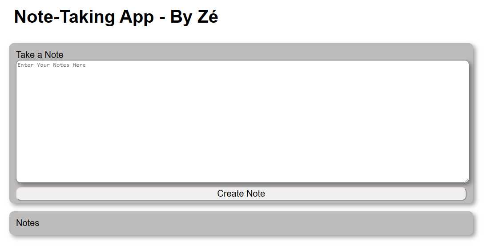

# NoteTakingApp
<h1> Description </h1>

 This App aims to take and hold notes from the user. So, in order to do that, it has some features as add a note, close a note, write the note in the text area and adjustable elements according to the screen size

 The main purpose of this project is just to learn and practice a little bit more about web tecnologies so feel confortable to suggest some features 👨🏻‍💻 and improvements

